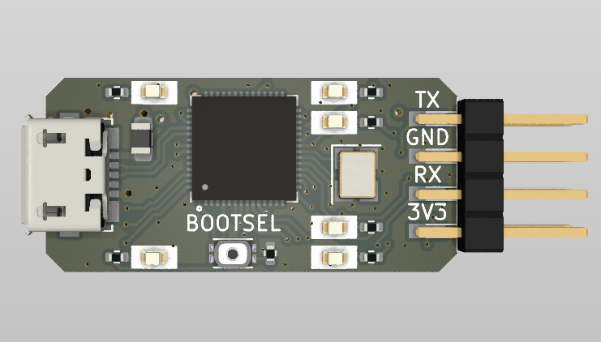
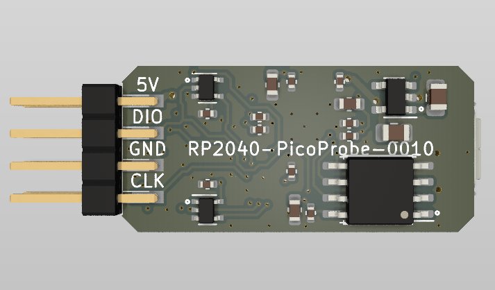
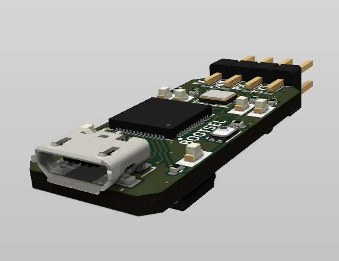

```
 ______ ______ ______ ______ _____  ______
|   __ \   __ \__    |      |  |  ||      |
|      <    __/    __|  --  |__    |  --  |
|___|__|___|  |______|______|  |__||______|
 ______ __              ______              __
|   __ \__|.----.-----.|   __ \.----.-----.|  |--.-----.
|    __/  ||  __|  _  ||    __/|   _|  _  ||  _  |  -__|
|___|  |__||____|_____||___|   |__| |_____||_____|_____|
```

# RP2040-PicoProbe Project

The **RP2040-PicoProbe** project aims to create even smaller version of RP2040-DebugProbe.

## RP2040-PicoProbe Board

The **RP2040-PicoProbe** board is a 4-layer design intended to accommodate the popular Raspberry Pi RP2040 MCU with all required component to function identically to Raspberry Pi Debug Probe.

This board features target debug connector and PC host micro-USB connector.The board is pin-compatible with Raspberry Pi Debug Probe and can be used with the same picoprobe SW.

Preview:





You can view the [Schematics in PDF format](doc/RP2040-PicoProbe.pdf) for detailed information.

STEP 3D file is available [with pins](doc/RP2040-PicoProbe.step).

Features:

- Very small form-factor of about 28x13mm, about 37x13mm with pins.
- Raspberry Pi RP2040 MCU as a heart of the board.
- 2x8 2.54mm SWD/UART/Power connector for programming and debugging.
- Micro USB connector for power and communication.
- Several LEDs to indicate power and status.
- Castellated holes connector for main MCU debugging.
- BOOTSEL button to enter the bootloader mode for flashing new picoprobe SW.
- Pin-compatible with Raspberry Pi Debug Probe.
- Double-sided assembly.

CAM files, as well as the BOM and CPL files for JLCPCB, are available.

## Version History

### v1.0b1


Initial release for testing purposes.

## Links

- [Raspberry Pi RP2040 information page](https://www.raspberrypi.com/documentation/microcontrollers/rp2040.html).
- [Raspberry Pi Debug Probe information page](https://www.raspberrypi.com/documentation/microcontrollers/debug-probe.html).
- [Picoprobe SW for the board](https://github.com/raspberrypi/picoprobe).

## How to Help

Your contributions as code, resources, or finances are welcome! Please contact me directly via email at andriy.golovnya@gmail.com or through my [GitHub profile](https://github.com/red-scorp).

If you'd like to make a financial contribution, you can donate via [PayPal](http://paypal.me/redscorp) or [Ko-Fi](http://ko-fi.com/redscorp). Your support is greatly appreciated.

Thanks in advance!